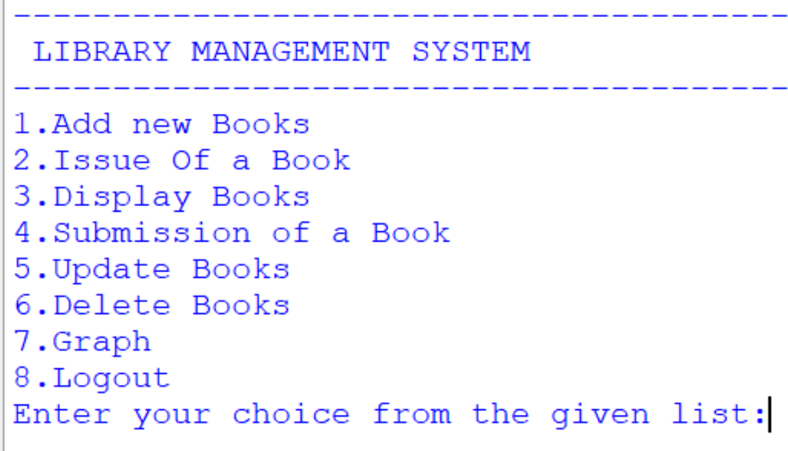
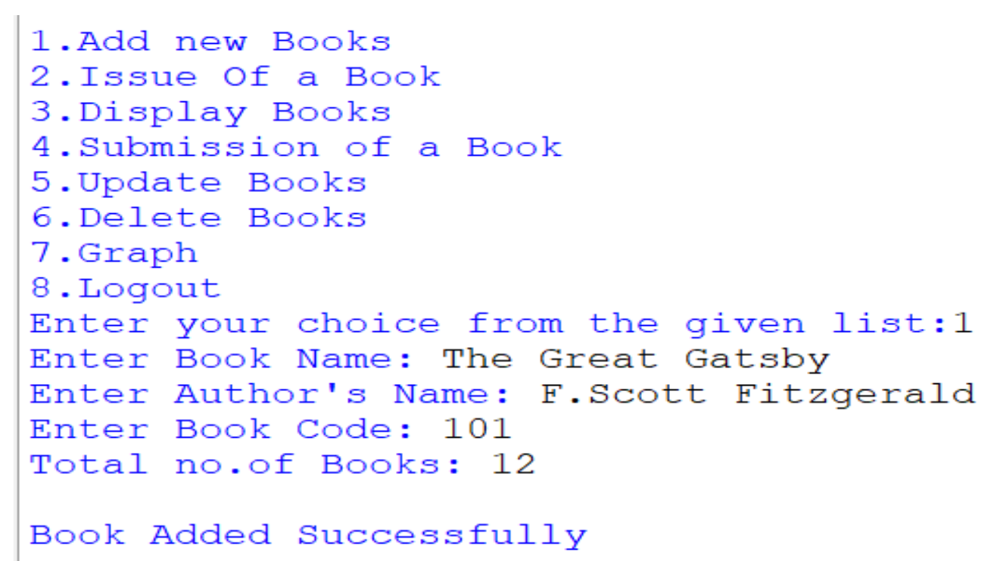
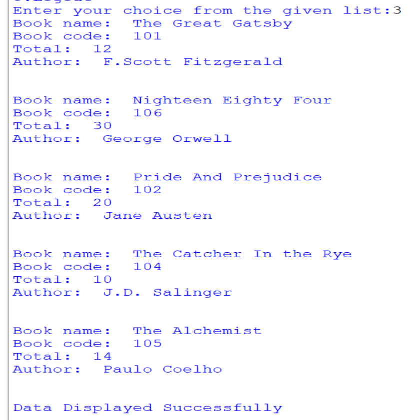
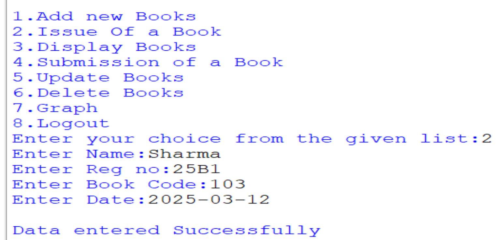
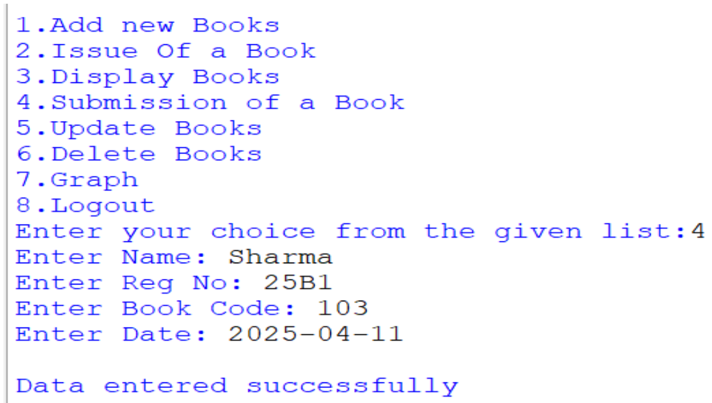
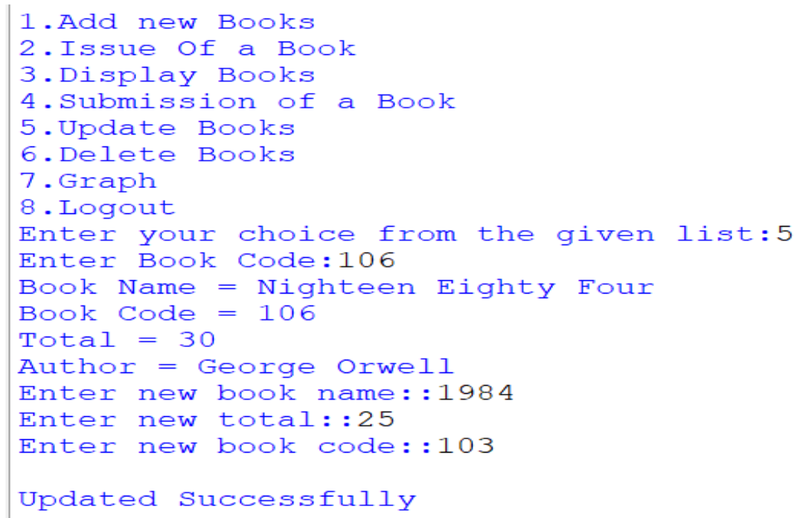
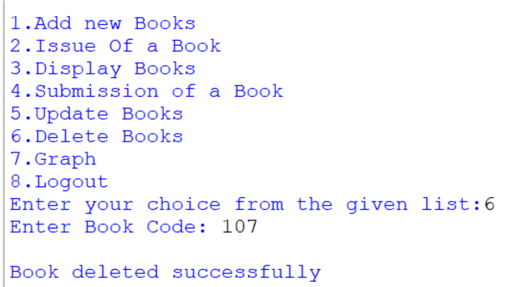
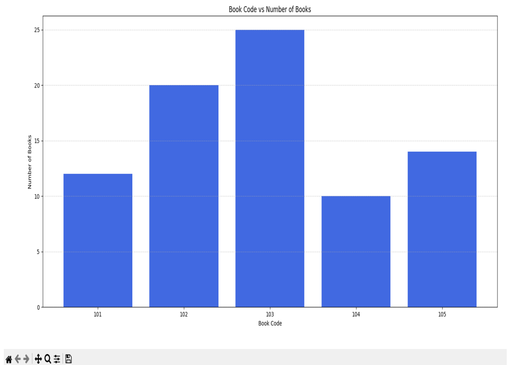

# Library Management System

## Overview

The Library Management System is a console-based application developed using Python and MySQL to automate basic library operations. It enables users to manage book records, issue and return books, update book details, and visualize library data through a simple menu-driven interface.

This project was developed as part of my undergraduate coursework to demonstrate database connectivity and CRUD operations using Python.

---

## Learning Outcomes

This project helped me gain practical experience with:

- Python programming
- MySQL database connectivity using PyMySQL
- CRUD operations
- Menu-driven application development
- Data visualization using Matplotlib

## Features

- Add new books to the library database
- Display all available books
- Issue books to users
- Record returned books
- Update existing book details
- Delete book records
- Visualize book availability using a bar graph

---

## Technologies Used

- Python
- MySQL
- PyMySQL
- Matplotlib

---

## Project Structure

```
Library-Management-System/
│
├── README.md
├── .gitignore
├── requirements.txt
│
├── src/
│   └── main.py
│
├── database/
│   └── library_management.sql
│
└── screenshots/
    ├── home.png
    ├── add_book.png
    ├── issue_book.png
    ├── display_books.png
    ├── submit_book.png
    ├── update_book.png
    ├── delete_book.png
    └── graph.png
```

---

## Installation

1. Clone the repository.

```bash
git clone https://github.com/KOTRASAISOUMYASRI/Library-Management-System.git
```

2. Navigate to the project directory.

```bash
cd Library-Management-System
```

3. Install the required Python packages.

```bash
pip install -r requirements.txt
```

4. Create the database by executing the SQL script located in the `database` folder.

5. Open `src/main.py` and update the MySQL connection details with your username and password.

6. Run the application.

```bash
python src/main.py
```

---

## Database

Run the SQL script below to create the required database and tables.

```
database/library_management.sql
```

---

## Screenshots

### Home Screen



### Add Book



### Display Books



### Issue Book



### Return Book



### Update Book



### Delete Book



### Book Statistics



---

## Future Enhancements

- Develop a graphical user interface (GUI)
- Implement user authentication
- Add search and filtering options
- Generate reports for issued and returned books
- Export reports in PDF or Excel format

---

## Author

**Kotra Sai Soumya Sri**

B.Tech in Computer Science and Engineering  
PES University
